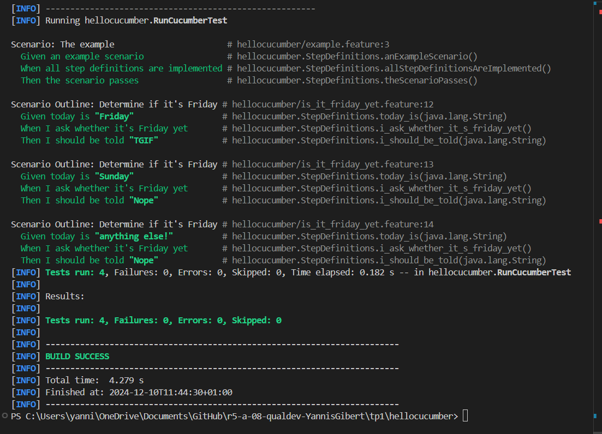
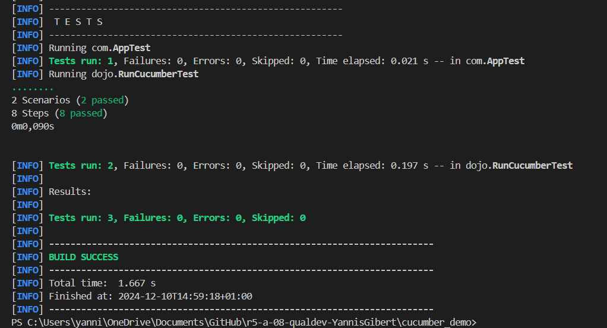

= R5.A.08 -- Dépôt pour les TPs
:icons: font
:MoSCoW: https://fr.wikipedia.org/wiki/M%C3%A9thode_MoSCoW[MoSCoW]

Ce dépôt concerne les rendus de mailto:A_changer@etu.univ-tlse2.fr[Jonh Doe].

== TP1

.Exemple de code
[source,java]
---
# language: en
Feature: Is it Friday yet?
  Everybody wants to know if it's Friday yet.

  Scenario Outline: Determine if it's Friday
    Given today is "<day>"
    When I ask whether it's Friday yet
    Then I should be told "<answer>"

    Examples:
      | day            | answer |
      | Friday         | TGIF   |
      | Sunday         | Nope   |
      | anything else! | Nope   |

---

.Image des résultats des test du tp1

== TP2...
.Exemple de code
[source,java]
---
package dojo;

import java.util.ArrayList;
import java.util.List;

public class Order {
    private String owner;
    private String target;
    private List<String> cocktails;

    public Order() {
        this.cocktails = new ArrayList<>();
    }

    public void declareOwner(String owner) {
        this.owner = owner;
    }

    public void declareTarget(String target) {
        this.target = target;
    }

    public void addCocktail(String cocktail) {
        this.cocktails.add(cocktail);
    }

    public List<String> getCocktails() {
        return this.cocktails;
    }

    public String getOwner() {
        return this.owner;
    }

    public String getTarget() {
        return this.target;
    }
}

---
.Image des résultats des test du tp1
